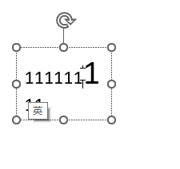
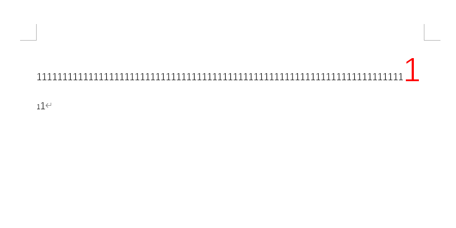
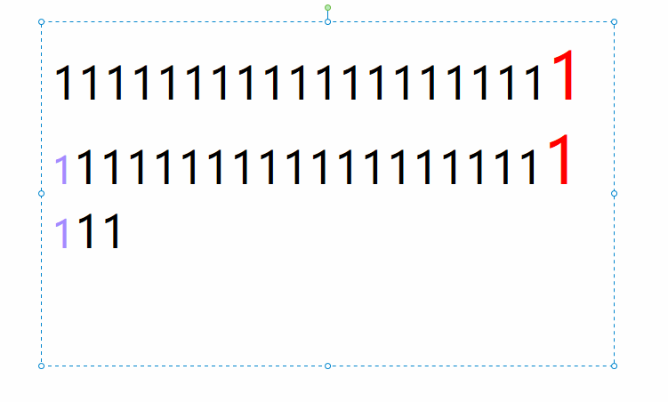
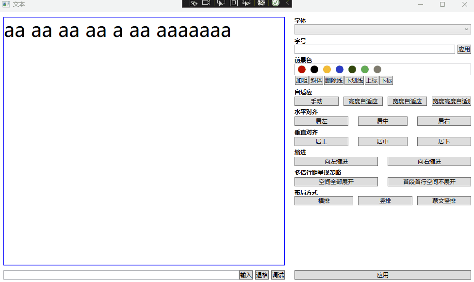
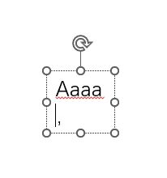

# 行为定义

设计上以 WPF 为准，其他平台上的文本渲染没有微软 Windows 下看得顺。所有行为向 Word 靠拢

## 光标

### 段内换行的光标行为

在一段文本超过文本框的宽度尺寸时，将会进行换行。在光标移动到第二行的行首时，此时的光标应该跟随哪个字符的样式

在段内换行的行首时的光标，有三个不同的选择行为：

行为1：

光标将按照光标前一个字符的属性进行显示，输入时也继承光标前一个字符的样式。这是 PPT 的行为，如下图



不过在 Word 中，光标的尺寸是一个诡异的跟随，既不是光标前一个字符的，也不是光标后一个字符的，也不是段落默认字符属性的，如下图




行为2：

光标将按照段落属性，而不是跟随光标前一个字符的属性。这是在 EN 的行为，如下图



光标只要进入新行，那就采用段落样式，段落样式的更改之后在段落第一个字符之前才能更改，如下图是进行更改段落的字符属性，更改之后，进入新行之后即可让光标使用段落字符属性，如下图


行为3：

光标在进入第二行的行首时，将按照光标后一个字符的属性进行显示。暂时没有找到任何一个软件使用此行为

## 行间距

### 单行行距算法

方法0： 使用 `glyphTypeface.AdvanceHeights[glyphIndex] * fontSize` 的值

计算出来的行高过小，例如输入 `agf` 可以看到 `g` 是超过行的高度的，只能计算到基线的高度

方法1： 通过 ComputeInkBoundingBox 计算。此计算方法计算出来的值将远远大于视觉效果

```csharp
                var pixelsPerDip = (float) VisualTreeHelper.GetDpi(_textEditor).PixelsPerDip;
                var glyphIndices = new[] { glyphIndex };
                var advanceWidths = new[] { width };
                var characters = new[] { c };

                var location = new System.Windows.Point(0, 0);
                var glyphRun = new GlyphRun
                (
                    glyphTypeface,
                    bidiLevel: 0,
                    isSideways: false,
                    renderingEmSize: fontSize,
                    pixelsPerDip: pixelsPerDip,
                    glyphIndices: glyphIndices,
                    baselineOrigin: location, // 设置文本的偏移量
                    advanceWidths: advanceWidths, // 设置每个字符的字宽，也就是字号
                    glyphOffsets: null, // 设置每个字符的偏移量，可以为空
                    characters: characters,
                    deviceFontName: null,
                    clusterMap: null,
                    caretStops: null,
                    language: DefaultXmlLanguage
                );
                var computeInkBoundingBox = glyphRun.ComputeInkBoundingBox();

                var matrix = new Matrix();
                matrix.Translate(location.X, location.Y);
                computeInkBoundingBox.Transform(matrix);
                //相对于run.BuildGeometry().Bounds方法，run.ComputeInkBoundingBox()会多出一个厚度为1的框框，所以要减去
                if (computeInkBoundingBox.Width >= 2 && computeInkBoundingBox.Height >= 2)
                {
                    computeInkBoundingBox.Inflate(-1, -1);
                }

                var bounds = computeInkBoundingBox;
```

大部分情况下不会采用方法1来计算

参考 https://github.com/lindexi/lindexi_gd/blob/57c17aebbc28e36bef381e83c86d13bd92599b03/LightTextEditorPlus/LightTextEditorPlus.Wpf/TextEditor.cs#L276-L299

方法2：根据 WPF 行高算法 `height = fontSize * fontFamily.LineSpacing` 这不等于 `glyphTypeface.AdvanceHeights[glyphIndex] * fontSize` 的值

```csharp
                var fontFamily = new FontFamily("微软雅黑"); // 这里强行使用微软雅黑，只是为了测试
                height = fontSize * fontFamily.LineSpacing;
```

或者是将 `fontSize` 替换为 `glyphTypeface.AdvanceHeights[glyphIndex] * fontSize` 的值

```csharp
                height = glyphTypeface.AdvanceHeights[glyphIndex] * fontSize * fontFamily.LineSpacing;
```

这也是当前文本库使用的计算方法

方法3：根据 PPT 行高算法公式 `PPTPixelLineSpacing = (a * PPTFL * OriginLineSpacing + b) * FontSize` 进行计算

```csharp
const double pptFontLineSpacing = 1.2018;
const double b = 0.0034;
const int lineSpacing = 1;
height = (pptFontLineSpacing * lineSpacing + b) * height;
```
这也是当前文本库使用的计算方法

## 换行算法

[自动换行 - 维基百科，自由的百科全书](https://zh.wikipedia.org/zh-hans/%E8%87%AA%E5%8A%A8%E6%8D%A2%E8%A1%8C )

[折行算法（word warp） - 台部落](https://www.twblogs.net/a/5b84bb972b71775d1cd19cf0 )

Knuth-Plass断行算法

自动换行 折行算法 断行算法 其实都是一回事

优先采用的是贪心算法，这个算法比较好实现且性能较好。接着需要考虑语言文化的换行规则

### 排版分词换行

如果单行空间足够放下单词，单词不拆分为两行布局



如果单行空间不够放下单词，拆分单词放入多行

超长单词采用 后拆分 方式，即在当前行已存在字符时，遇到超长单词时，将超长单词排入下一行，如超长单词超过一行宽度，则分行。此行为和 PPT 相同


### 标点符号分行方式

在不允许标点溢出边界的前提下：

如果一行刚好放不下标点符号，且此标点符号不允许放在行首的情况下，去标点符号前一个单词，和标点符号一起放在下一行

如果一行的宽度不够放下一个单词加标点符号的宽度，则允许标点符号单独成行




### 中文标点

中文标点参考 GB/T 15834 规范，但是由于规范实现比较复杂，只实现部分