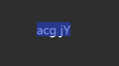

测试版本： 6de0f5e97b07852e8f97fea39ca331effd96a91b

问题描述：

采用默认的 `LineSpacingAlgorithm.PPT` 算法时，计算到的行高内容未覆盖字符高度，导致选择范围没有覆盖整个字符的渲染范围

直观看就是如 `acg` 字符中，可见 `g` 字符的下半部分在选择范围之外，如下图所示

问题原因： 详见 `2025-05-29-Skia渲染Y坐标定位与修复.md` 文档