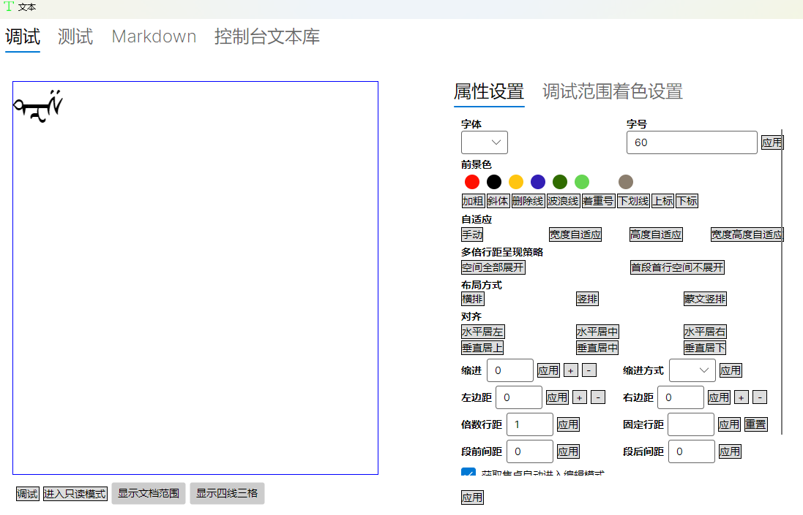
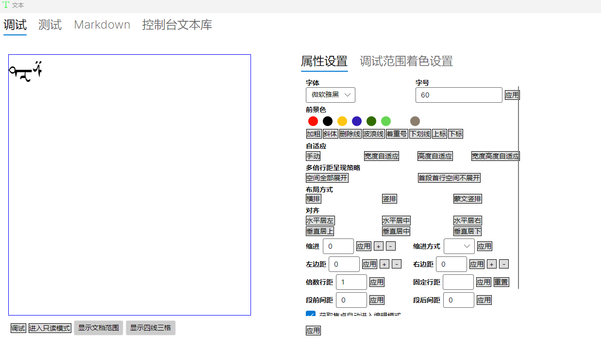

测试版本： ad1b1c98006ea0f60d3c33a5676ea654feb18066

复现步骤：

  - 运行 LightTextEditorPlus.AvaloniaDemo
  - 在文本编辑器输入连写字，如 "ᠳᠽᠱ"蒙文三个字符
  - 选择中间的字符，设置前景色为红色，再重新设置为黑色

预期结果：

重新改为黑色后，应该输出合写的连写蒙文内容

实际结果：

重新改为黑色后，输出分开的连写蒙文内容 "ᠳ ᠽ ᠱ"

