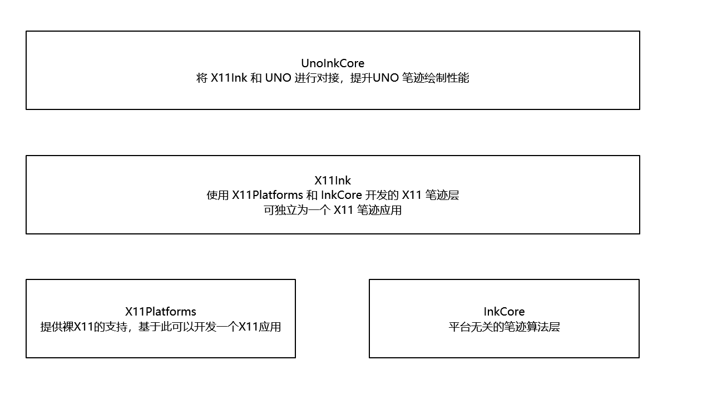

# 代码框架

1. 从 UNO 接收输入，在 X11 绘制
   - 更新笔迹算法，降低延迟
   - 多线程同步和调度
   - 窗口层级关系
   - 停止渲染问题
   - 窗口穿透
   - 开发 01781d31ae7c06e094dabfb6f80d81a0877bd8ef t/lindexi/Ink 可以切分支
2. 从 UNO 接收输入，在 UNO 绘制，在 X11 显示
   - 可基于 42cfb47f083c60c0ec37f30be10d2ed945ae1123 重新开发
3. 从 X11 接收输入，在 X11 绘制，判断 UNO 命中
   - 去掉 ddad66981bd175e1ef84bd3bd547dc329964981c 即可使用，效果很好

- [ ] 落笔时闪烁
- [ ] 优化抬笔闪烁
  - 核心原因是渲染同步
- [x] 下一笔落下才能更新上一笔
  - 似乎是 UNO 的坑，经过了 8128f2e57cd68cfd283dd0a809fd6af34f956922 的输出测试，可以看到确实有绘制了笔迹内容
  - 使用 352158d626769f20240523d3350fa0db3f4caeba 可以修复，证明是 Uno 的问题，在 OnPaintSurface 不会自动刷新界面
- [x] 界面停止渲染或 X11的 XShapeCombineRegion 方法不会返回
  - 经过测试 点击命中穿透 的 SetClickThrough 不返回 7df81f1db2cc9ffa6c4b1dbdcfcc97308e551e96 回滚代码却能正常，似乎受到了 258a60849bcee8adab16c45b2303bb5f8e096058 的影响，但这里改动的是序列化。同步逐步抄代码，找到是在 369f36d6523bf1789b43b82d3c39e43d0b68ba96 这里没有执行渲染。还原代码 e7a4336a067f599aa6ece29c2d17b393427d2a97 依然正常，不知道炸哪里。加上输出信息之后，可以正常执行命中窗口方法，也进行返回 e24afd4f1281e1ebba950bd4e73adaaec4eb70df 不知道有什么关系
  - 只要主线程有输出，随便输出，就能修复 XShapeCombineRegion 方法不会返回。最简修复代码 fa08b6854bd9d43445fa3d9e93cb2ebc1d4a9cca
- [x] 测试给 UNO 注入多点触摸 86984cb5eab3fd16df49ab173ec129b7bdf7ec0e
- [x] 测试不开启另一个窗口是否命中
  - b2881a8307d73f42906da9ab18dfc03cc93ebd0c
  - 可以命中
- [x] 跨线程使用 skPath 将会炸掉应用
  - 最简复现 c82dcaf20da0948aede539b699f47926635b94a3
  - 实际原因是 SkInkCanvas 的 InkStrokePath 在 DrawStrokeContext 的 Dispose 被释放。加上 01fd5aebad41efef3ec9afaaaefcd30a0d674cb0 即可解决
