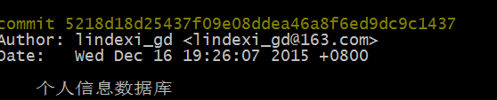
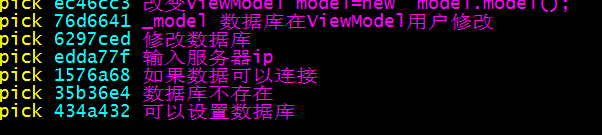
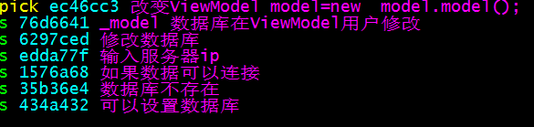

一个更改总是提交，仓库有好多看起来很乱的
git没有可以把最后一个提交提交到服务器的能力，可以用rebase
先使用分支做更改

```
git branch 更改
git checkout 更改
```

提交更改

```
git commit 更改
```

然后到主分支看最新提交

```
git checkout master
git log
```



记下那提交

把更改合并master

```
git merge 更改
```

用rebase把更改多个合为最后一个

```
git rebase -i 记下的提交
```


在打开的文件除了第一个pick，改为s

用i修改





修改按esc，：wq保存

然后文件按i修改，这是信息，提交信息


按esc：wq保存

提交就是最后一个


