win10 UWP Markdown 含源代码
Windows下没有比较好的Markdown编辑器

我就自己写一个

csdn的Markdown很好，就是我需要截图保存有麻烦

需要把我的截图保存在本地，然后上传

这个过程比较麻烦

csdn的图没法外链

我想把自己的博客放到github，发现都没有图片

我自己写了的，可以把截图保存为图片，放到用户位置

然后插入``

拖入图片也插入``

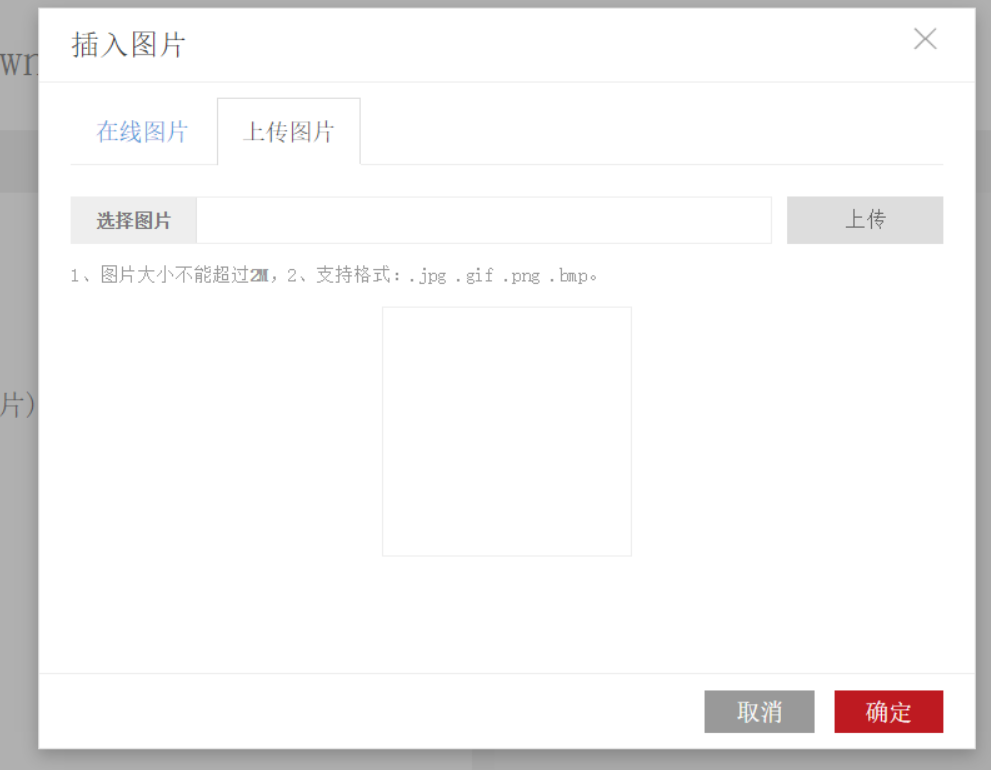

界面有编辑和设置

编辑由TopAppBar，TextBox作为输入和TextBlock显示

拖入文件可以使用Drop

在Grid写Drop="{x:Bind view.dropimg}" DragOver="Grid_DragOver"

Grid要AllowDrop="True"

在MainPage.xaml.cs

        private void Grid_DragOver(object sender, DragEventArgs e)
        {
            e.AcceptedOperation = Windows.ApplicationModel.DataTransfer.DataPackageOperation.Copy;
            e.DragUIOverride.Caption = "打开";
            e.Handled = true;
        }

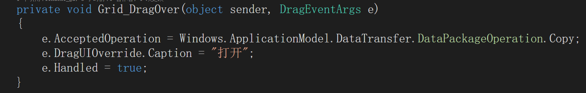

在viewModel

public async void dropimg(object sender, Windows.UI.Xaml.DragEventArgs e)

dropimg 处理拖进来的DataPackageView

            var defer = e.GetDeferral();
            try
            {
                DataPackageView dataView = e.DataView;
                string str = await _m.clipboard(dataView);
                tianjia(str);
            }
            finally
            {
                defer.Complete();
            }

文件有

MainPage.xaml

MainPage.xaml.cs

option.xaml

option.xaml.cs

viewModel.cs

model.cs

notify_property.cs

其中notify_property.cs提供继承通知UI改变值

model包括

正在编辑文件file

保存位置folder

其中folder根据StorageApplicationPermissions.FutureAccessList获得用户位置。

可以访问的路径不多，因为一个程序可以访问文件路径多，不安全。如果每次放在一个不是程序目录的位置，都要用户设置，很麻烦。在用户第一次使用，让用户选择一个位置，然后应用程序可以直接访问用户选择的这个，不用每次都选择。

用户输入text

标题 name

其中text和name都是public string _text;

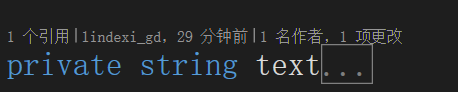

这样是在viewModel使用，可以OnPropertyChanged();

writetext是用户能输入，在没有设置用户位置，不能输入

_open是否打开

 public async Task<string> clipboard(DataPackageView con)

处理剪贴板和拖入内容

本来我是处理剪贴板，因为拖入也是DataPackageView 

        public async Task<string> clipboard(DataPackageView con)
        {
            string str = string.Empty;
            //文本
            if (con.Contains(StandardDataFormats.Text))
            {
                str = await con.GetTextAsync();
                //tianjiatext(str);
                return str;
            }

            //图片
            if (con.Contains(StandardDataFormats.Bitmap))
            {
                RandomAccessStreamReference img = await con.GetBitmapAsync();
                var imgstream = await img.OpenReadAsync();
                Windows.UI.Xaml.Media.Imaging.BitmapImage bitmap = new Windows.UI.Xaml.Media.Imaging.BitmapImage();
                bitmap.SetSource(imgstream);

                Windows.UI.Xaml.Media.Imaging.WriteableBitmap src = new Windows.UI.Xaml.Media.Imaging.WriteableBitmap(bitmap.PixelWidth, bitmap.PixelHeight);
                src.SetSource(imgstream);

                Windows.Graphics.Imaging.BitmapDecoder decoder = await Windows.Graphics.Imaging.BitmapDecoder.CreateAsync(imgstream);
                Windows.Graphics.Imaging.PixelDataProvider pxprd = await decoder.GetPixelDataAsync(Windows.Graphics.Imaging.BitmapPixelFormat.Bgra8, Windows.Graphics.Imaging.BitmapAlphaMode.Straight, new Windows.Graphics.Imaging.BitmapTransform(), Windows.Graphics.Imaging.ExifOrientationMode.RespectExifOrientation, Windows.Graphics.Imaging.ColorManagementMode.DoNotColorManage);
                byte[] buffer = pxprd.DetachPixelData();

                str = "image";
                StorageFolder folder = await _folder.GetFolderAsync(str);

                StorageFile file = await folder.CreateFileAsync(DateTime.Now.Year.ToString() + DateTime.Now.Month.ToString() + DateTime.Now.Day.ToString() + DateTime.Now.Hour.ToString() + DateTime.Now.Minute.ToString() + ".png", CreationCollisionOption.GenerateUniqueName);

                using (var fileStream = await file.OpenAsync(FileAccessMode.ReadWrite))
                {
                    var encoder = await Windows.Graphics.Imaging.BitmapEncoder.CreateAsync(Windows.Graphics.Imaging.BitmapEncoder.PngEncoderId, fileStream);
                    encoder.SetPixelData(Windows.Graphics.Imaging.BitmapPixelFormat.Bgra8, Windows.Graphics.Imaging.BitmapAlphaMode.Straight, decoder.PixelWidth, decoder.PixelHeight, decoder.DpiX, decoder.DpiY, buffer);
                    await encoder.FlushAsync();

                    str = $"";
                }
            }

            //文件
            if (con.Contains(StandardDataFormats.StorageItems))
            {
                var filelist = await con.GetStorageItemsAsync();
                StorageFile file = filelist.OfType<StorageFile>().First();
                return await imgfolder(file);
            }

            return str;
        }
返回string是因为要把str插入到text，需要有Textbox光标插入

插入文件

        public async Task<string> imgfolder(StorageFile file)
        {
            string str = "image";
            StorageFolder image = null;
            try
            {
                image = await _folder.GetFolderAsync(str);
            }
            catch
            {

            }
            if (image == null)
            {
                image = await _folder.CreateFolderAsync(str, CreationCollisionOption.OpenIfExists);
            }
            file = await file.CopyAsync(image, file.Name, NameCollisionOption.GenerateUniqueName);

            if (file.FileType == ".png" || file.FileType == ".jpg")
            {
                str = $"";
                return str;
            }
            else
            {
                str = $"[{file.Name}](image/{file.Name})";
                return str;
            }
        }
开始我没有用文件

拖入和剪贴板只用第一个文件

public async void accessfolder(StorageFolder folder)

更改用户位置

public async void storage()

保存

在程序运行

    folder = await Windows.Storage.AccessCache.StorageApplicationPermissions.FutureAccessList.GetFolderAsync(Windows.Storage.AccessCache.StorageApplicationPermissions.FutureAccessList.Entries[0].Token);

viewModel.cs

        public string text
        {
            set
            {
                _m._text = value;
                OnPropertyChanged();
            }
            get
            {
                return _m._text;
            }
        }

        public string name
        {
            set
            {
                _m._name = value;
                OnPropertyChanged();
            }
            get
            {
                return _m._name;
            }
        }

本来绑Textbox SelectionStart

SelectionStart错误

要用SelectionStart，只能public Action<int, int> selectchange;

在MainPage.xaml.cs

        private void selectchange(int select, int selecti)
        {
            text.SelectionStart = select;
            text.SelectionLength = selecti;
        }

因为选择可以把``

select Textbox选择的插入

clipboard 保存剪贴板

storage 保存

accessfolder 更改用户位置

        public async void accessfolder()
        {
            FolderPicker pick = new FolderPicker();
            pick.FileTypeFilter.Add("*");
            StorageFolder folder = await pick.PickSingleFolderAsync();
            if (folder != null)
            {
                _m.accessfolder(folder);
            }
            addressfolder = string.Empty;
        }

model _m

        private void tianjia(string str)

把str添加text

MainPage.xaml

    <Grid Background="{ThemeResource ApplicationPageBackgroundThemeBrush}" AllowDrop="True" Drop="{x:Bind view.dropimg}" DragOver="Grid_DragOver">
        <Grid.RowDefinitions>
            <RowDefinition Height="auto"/>
            <RowDefinition />
            <RowDefinition Height="auto"/>
        </Grid.RowDefinitions>
        <TextBox Text="{x:Bind view.name,Mode=TwoWay}" Grid.Row="0" Margin="10,10,10,10"/>
        <TextBox x:Name="text" Text="{Binding Path=text,Mode=TwoWay,UpdateSourceTrigger=PropertyChanged}" Margin="10,10,10,10" Grid.Row="1" TextWrapping="Wrap" AcceptsReturn="True" IsReadOnly="{x:Bind view.writetext,Mode=OneWay}" SelectionChanged="text_SelectionChanged"/>
        <!--<RichEditBox x:Name="rtext" Margin="10,10,10,10"/>-->

        <TextBlock Text="{x:Bind view.reminder,Mode=OneWay}" Grid.Row="2" Margin="10,10,10,10" TextWrapping="Wrap"/>
        <!--<Button Content="确定" Click="{x:Bind view.property}" Margin="121,300,0,308"/>-->
    </Grid>
    <Page.TopAppBar>
        <CommandBar>
            <!--<AppBarButton Icon="Add" Content="新建" Click="{x:Bind view.fileaddress}"/>-->
            <AppBarButton Icon="OpenFile" Content="打开" Click="{x:Bind view.file_open}" />
            <AppBarButton Icon="Save" Content="保存" Click="{x:Bind view.storage}"/>
            <AppBarButton Icon="Setting" Content="设置" Click="option"/>
        </CommandBar>
    </Page.TopAppBar>

    public sealed partial class MainPage
    {
        viewModel view;
        public MainPage()
        {            
            this.InitializeComponent();
            text.Paste += Text_Paste;
        }

        private void Text_Paste(object sender, TextControlPasteEventArgs e)
        {
            view.clipboard(e);
        }

        private void Grid_DragOver(object sender, DragEventArgs e)
        {
            e.AcceptedOperation = Windows.ApplicationModel.DataTransfer.DataPackageOperation.Copy;
            e.DragUIOverride.Caption = "打开";
            e.Handled = true;
        }

        private void text_SelectionChanged(object sender, RoutedEventArgs e)
        {
            view.select = text.SelectionStart;
        }

        private void selectchange(int select, int selecti)
        {
            text.SelectionStart = select;
            text.SelectionLength = selecti;
        }

        private bool _ctrl;

        private void text_KeyDown(object sender, KeyRoutedEventArgs e)
        {
            if (e.Key.Equals(Windows.System.VirtualKey.Control))
            {
                _ctrl = true;
            }
            else if (e.Key == Windows.System.VirtualKey.V && _ctrl)
            {

            }

            if (_ctrl)
            {
                if (e.Key == Windows.System.VirtualKey.Z)
                {

                }
            }

            e.Handled = true;
        }

        private void text_KeyUp(object sender, KeyRoutedEventArgs e)
        {
            if (e.Key.Equals(Windows.System.VirtualKey.Control))
            {
                _ctrl = false;
            }
        }

        private void option(object sender, RoutedEventArgs e)
        {
            view.storage();
            Frame frame = Window.Current.Content as Frame;
            frame.Navigate(typeof(option), view);
        }

        protected override void OnNavigatedTo(NavigationEventArgs e)
        {
            base.OnNavigatedTo(e);
            if (e.Parameter is viewModel)
            {
                view = e.Parameter as viewModel;
                DataContext = view;
            }
            else
            {
                view = new viewModel();
                view.selectchange = selectchange;               
                this.DataContext = view;
            }

        }
    }

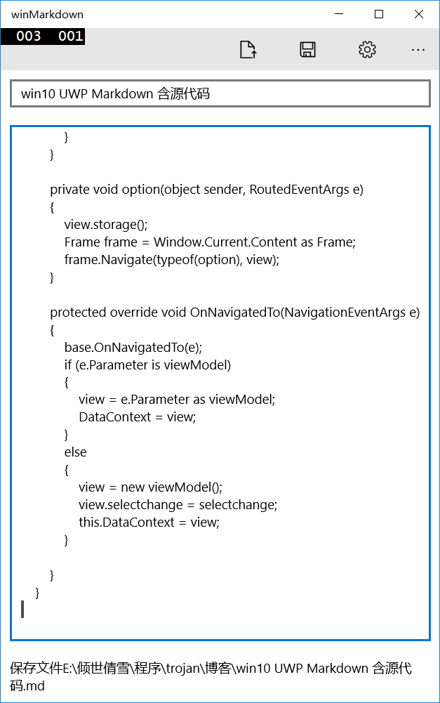

##发布

https://dev.windows.com/zh-cn

登录

在我的应用

.png)

填名字

.png)

本来想写Markdown

不过自己做的不是很好，不敢，就写win

有人发了Markdown应用

点击开始提交

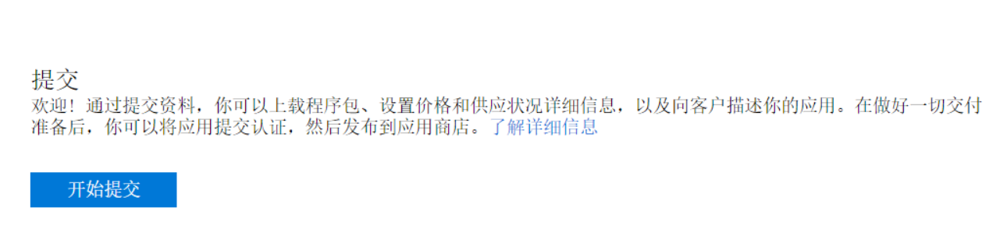

价格免费

在visual studio

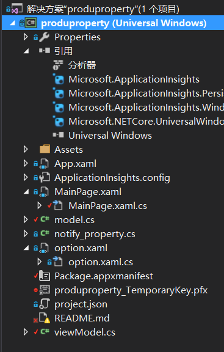

关联

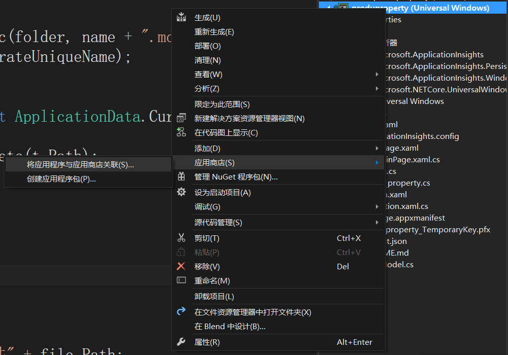

.png)

选择创建的Markdown

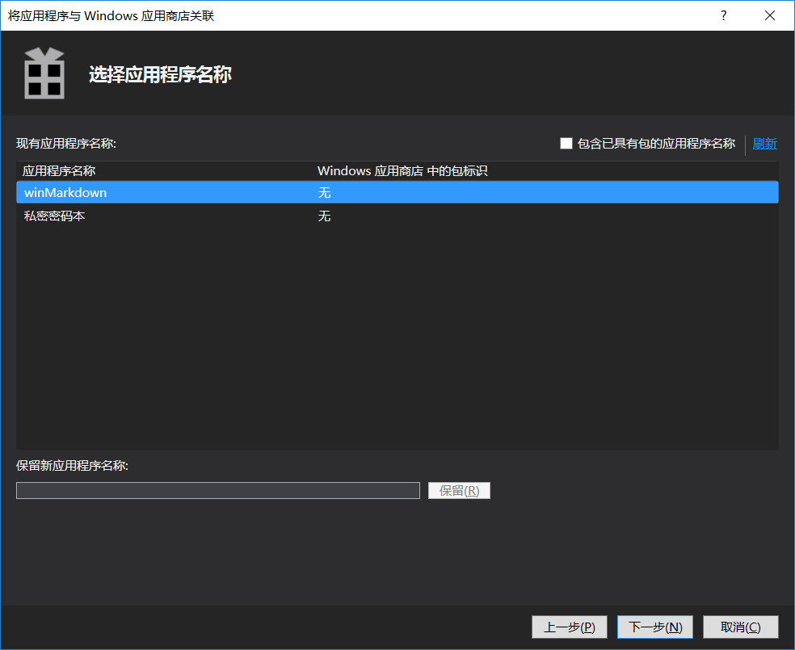

得到

produproperty_StoreKey.pfx

在属性

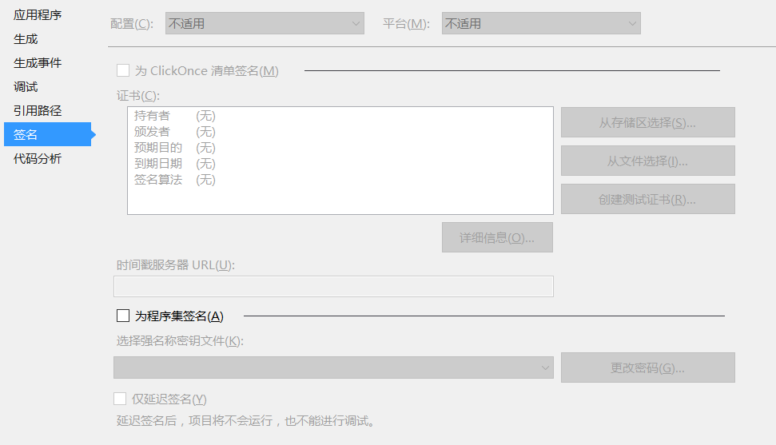

没有密码

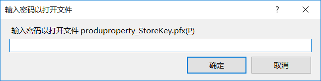

.png)

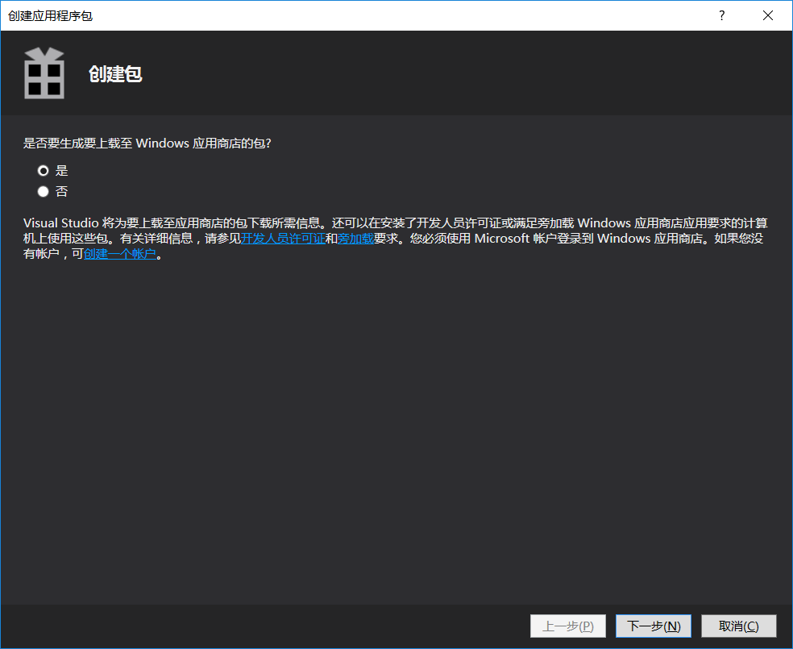

.png)

配置

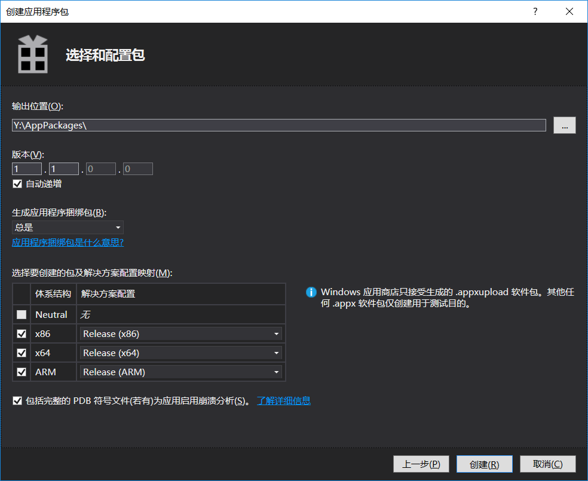

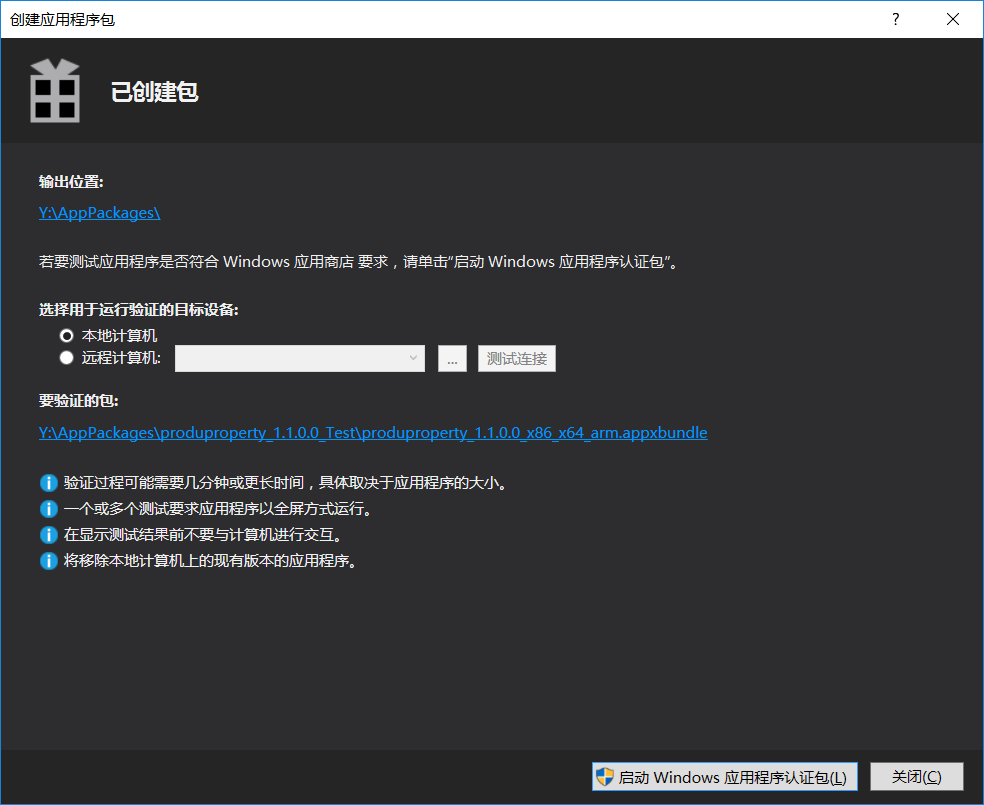

把produproperty_1.1.0.0_x86_x64_arm_bundle.appxupload上传

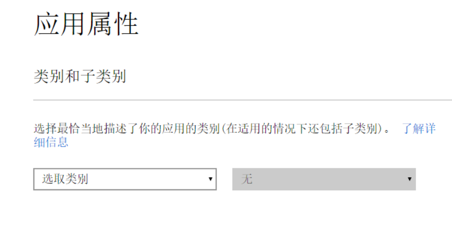

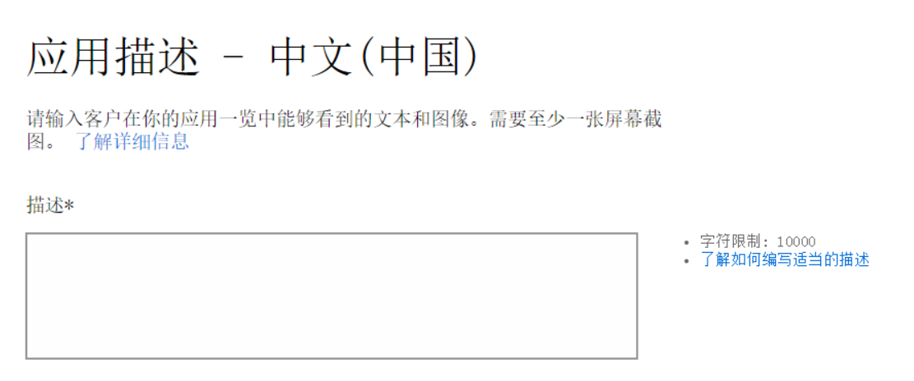

.png)