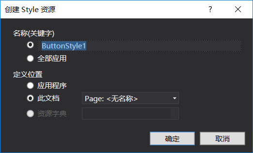
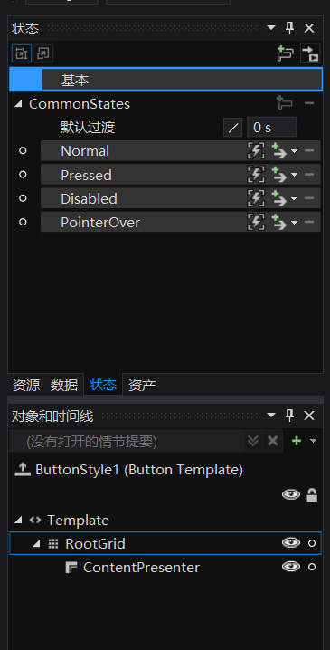
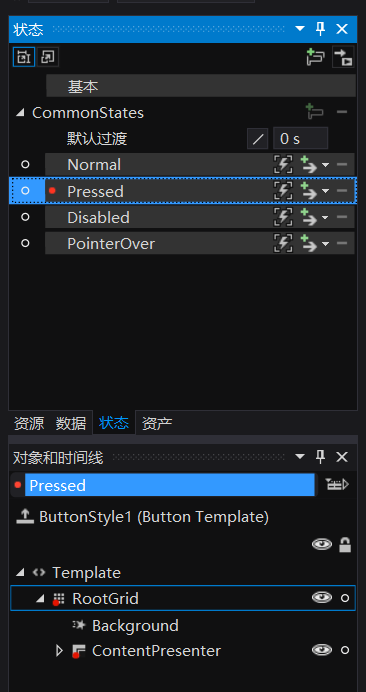
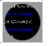
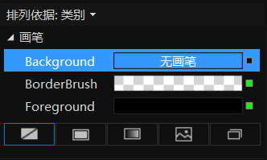
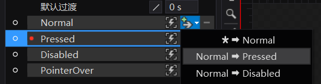
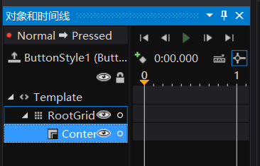
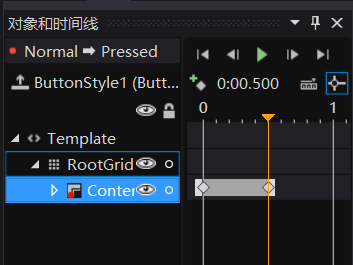
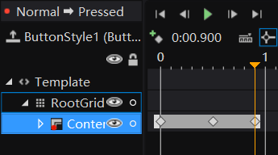
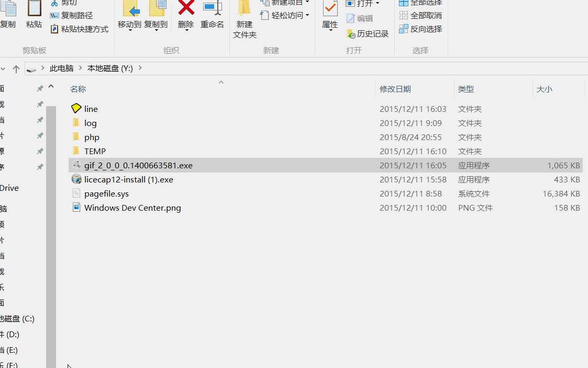

button有很多和wpf一样，可以看《深入浅出WPF》

我们可以在button的click写上
```
<Button Content="确定" Click="Button_Click"/>
```
在Button_Click按F12到代码写上点击按钮需要运行
```
        private void Button_Click(object sender, RoutedEventArgs e)
        {

        }
```

也可以用viewModel的一个方法
viewModel有一个方法 ce

可以在Click写
```
Click="{x:Bind view.ce}"
```
在用view需要在MainPage.xaml.cs写
```
viewModel view {set;get;}= new viewModel();

```

button content可以使用一个元素，这个元素可以是Grid，我们可以做一个圆形头像

先找出一张图，我们把这张图做头像

把图放到项目

```
                <Button Height="100" Width="100" Margin="10,10,10,10" Padding="0" Foreground="{x:Null}" BorderBrush="{x:Null}" Background="{x:Null}"> 
                    <Button.Content>                       
                            <Ellipse Margin="0,0,0,0" Height="90" Width="90">
                                <Ellipse.Fill>
                                    <ImageBrush ImageSource="Assets/20151226160608688.jpg" />
                                </Ellipse.Fill>
                            </Ellipse>                                          
                    </Button.Content>
                </Button>
```

我们可以修改鼠标在按钮上的样子


button可以设置属性，使用资源
资源可以写在页面

```
    <Page.Resources>
        
    </Page.Resources>
```

所有按钮使用同样式

```
    <Page.Resources>
        <Style TargetType="Button">
            
        </Style>
    </Page.Resources>
```

按钮的属性用`<Setter Property="属性" Value="值"/>`

按钮的背景

```
    <Page.Resources>
        <Style TargetType="Button">
            <Setter Property="Background" Value="White"/>
        </Style>
    </Page.Resources>
```

指定一个样式，key

```
    <Page.Resources>
        <Style TargetType="Button">
            <Setter Property="Background" Value="White"/>
            <Setter Property="Width" Value="100"/>
            <Setter Property="Height" Value="100"/>
        </Style>
        <Style  x:Key="button" TargetType="Button">
            <Setter Property="Background" Value="White"/>
            <Setter Property="Width" Value="50"/>
            <Setter Property="Height" Value="50"/>
        </Style>
    </Page.Resources>
```

```
         <Button Content="默认"/>
         <Button Style="{StaticResource button}" Content="确定"/>
```


在设计，点按钮，右击，编辑模板副本，选择当前页


可以看到
```xaml
    <Page.Resources>
        <Style x:Key="ButtonStyle1" TargetType="Button">
            <Setter Property="Background" Value="{ThemeResource SystemControlBackgroundBaseLowBrush}"/>
            <Setter Property="Foreground" Value="{ThemeResource SystemControlForegroundBaseHighBrush}"/>
            <Setter Property="BorderBrush" Value="{ThemeResource SystemControlForegroundTransparentBrush}"/>
            <Setter Property="BorderThickness" Value="{ThemeResource ButtonBorderThemeThickness}"/>
            <Setter Property="Padding" Value="8,4,8,4"/>
            <Setter Property="HorizontalAlignment" Value="Left"/>
            <Setter Property="VerticalAlignment" Value="Center"/>
            <Setter Property="FontFamily" Value="{ThemeResource ContentControlThemeFontFamily}"/>
            <Setter Property="FontWeight" Value="Normal"/>
            <Setter Property="FontSize" Value="{ThemeResource ControlContentThemeFontSize}"/>
            <Setter Property="UseSystemFocusVisuals" Value="True"/>
            <Setter Property="Template">
                <Setter.Value>
                    <ControlTemplate TargetType="Button">
                        <Grid x:Name="RootGrid" Background="{TemplateBinding Background}">
                            <VisualStateManager.VisualStateGroups>
                                <VisualStateGroup x:Name="CommonStates">
                                    <VisualState x:Name="Normal">
                                        <Storyboard>
                                            <PointerUpThemeAnimation Storyboard.TargetName="RootGrid"/>
                                        </Storyboard>
                                    </VisualState>
                                    <VisualState x:Name="PointerOver">
                                        <Storyboard>
                                            <ObjectAnimationUsingKeyFrames Storyboard.TargetProperty="BorderBrush" Storyboard.TargetName="ContentPresenter">
                                                <DiscreteObjectKeyFrame KeyTime="0" Value="{ThemeResource SystemControlHighlightBaseMediumLowBrush}"/>
                                            </ObjectAnimationUsingKeyFrames>
                                            <ObjectAnimationUsingKeyFrames Storyboard.TargetProperty="Foreground" Storyboard.TargetName="ContentPresenter">
                                                <DiscreteObjectKeyFrame KeyTime="0" Value="{ThemeResource SystemControlHighlightBaseHighBrush}"/>
                                            </ObjectAnimationUsingKeyFrames>
                                            <PointerUpThemeAnimation Storyboard.TargetName="RootGrid"/>
                                        </Storyboard>
                                    </VisualState>
                                    <VisualState x:Name="Pressed">
                                        <Storyboard>
                                            <ObjectAnimationUsingKeyFrames Storyboard.TargetProperty="Background" Storyboard.TargetName="RootGrid">
                                                <DiscreteObjectKeyFrame KeyTime="0" Value="{ThemeResource SystemControlBackgroundBaseMediumLowBrush}"/>
                                            </ObjectAnimationUsingKeyFrames>
                                            <ObjectAnimationUsingKeyFrames Storyboard.TargetProperty="BorderBrush" Storyboard.TargetName="ContentPresenter">
                                                <DiscreteObjectKeyFrame KeyTime="0" Value="{ThemeResource SystemControlHighlightTransparentBrush}"/>
                                            </ObjectAnimationUsingKeyFrames>
                                            <ObjectAnimationUsingKeyFrames Storyboard.TargetProperty="Foreground" Storyboard.TargetName="ContentPresenter">
                                                <DiscreteObjectKeyFrame KeyTime="0" Value="{ThemeResource SystemControlHighlightBaseHighBrush}"/>
                                            </ObjectAnimationUsingKeyFrames>
                                            <PointerDownThemeAnimation Storyboard.TargetName="RootGrid"/>
                                        </Storyboard>
                                    </VisualState>
                                    <VisualState x:Name="Disabled">
                                        <Storyboard>
                                            <ObjectAnimationUsingKeyFrames Storyboard.TargetProperty="Background" Storyboard.TargetName="RootGrid">
                                                <DiscreteObjectKeyFrame KeyTime="0" Value="{ThemeResource SystemControlBackgroundBaseLowBrush}"/>
                                            </ObjectAnimationUsingKeyFrames>
                                            <ObjectAnimationUsingKeyFrames Storyboard.TargetProperty="Foreground" Storyboard.TargetName="ContentPresenter">
                                                <DiscreteObjectKeyFrame KeyTime="0" Value="{ThemeResource SystemControlDisabledBaseLowBrush}"/>
                                            </ObjectAnimationUsingKeyFrames>
                                            <ObjectAnimationUsingKeyFrames Storyboard.TargetProperty="BorderBrush" Storyboard.TargetName="ContentPresenter">
                                                <DiscreteObjectKeyFrame KeyTime="0" Value="{ThemeResource SystemControlDisabledTransparentBrush}"/>
                                            </ObjectAnimationUsingKeyFrames>
                                        </Storyboard>
                                    </VisualState>
                                </VisualStateGroup>
                            </VisualStateManager.VisualStateGroups>
                            <ContentPresenter x:Name="ContentPresenter" AutomationProperties.AccessibilityView="Raw" BorderBrush="{TemplateBinding BorderBrush}" BorderThickness="{TemplateBinding BorderThickness}" ContentTemplate="{TemplateBinding ContentTemplate}" ContentTransitions="{TemplateBinding ContentTransitions}" Content="{TemplateBinding Content}" HorizontalContentAlignment="{TemplateBinding HorizontalContentAlignment}" Padding="{TemplateBinding Padding}" VerticalContentAlignment="{TemplateBinding VerticalContentAlignment}"/>
                        </Grid>
                    </ControlTemplate>
                </Setter.Value>
            </Setter>
        </Style>
    </Page.Resources>
```

在` <VisualState x:Name="Pressed">`可以把里面写成这个状态的样子，按钮有正常，按下，鼠标在按钮上，可以对每个修改



点击Pressed更改pressed



看到这里按钮有背景



去掉背景，按F4把背景无画笔



添加过度



记录关键帧



选时间0.5改变背景



选时间，改变背景



点播放可以看到我们做出来的

可以运行


移动到button显示文字

在装机必备移动到搜狐显示搜狐
参考：http://blog.csdn.net/lindexi_gd/article/details/50166161

```
                        <Button Click="souhu_Click" ToolTipService.ToolTip="搜狐视频" Padding="0" >
                            <Button.Content>
                                <Grid>
                                    <Grid.RowDefinitions>
                                        <RowDefinition Height="auto"/>
                                        <RowDefinition Height="auto"/>
                                    </Grid.RowDefinitions>
                                    <Image Source="ms-appx:///Assets/搜狐.png" Grid.Row="0" ScrollViewer.VerticalScrollBarVisibility="Disabled" />
                                    <TextBlock Text="搜狐视频" Grid.Row="1" HorizontalAlignment="Center" />
                                </Grid>
                            </Button.Content>
                        </Button>
```



显示图片

```
                        <Button Click="souhu_Click" Padding="0" >
                            <Button.Content>
                                <Grid>
                                    <Grid.RowDefinitions>
                                        <RowDefinition Height="auto"/>
                                        <RowDefinition Height="auto"/>
                                    </Grid.RowDefinitions>
                                    <Image Source="ms-appx:///Assets/搜狐.png" Grid.Row="0" ScrollViewer.VerticalScrollBarVisibility="Disabled" />
                                    <TextBlock Text="搜狐视频" Grid.Row="1" HorizontalAlignment="Center" />
                                </Grid>
                            </Button.Content>
                            <ToolTipService.ToolTip>
                                <Image Height="50" Width="50" Source="ms-appx:///Assets/搜狐.png"/>
                            </ToolTipService.ToolTip>
                        </Button>
```

