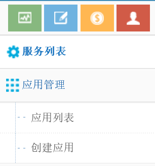
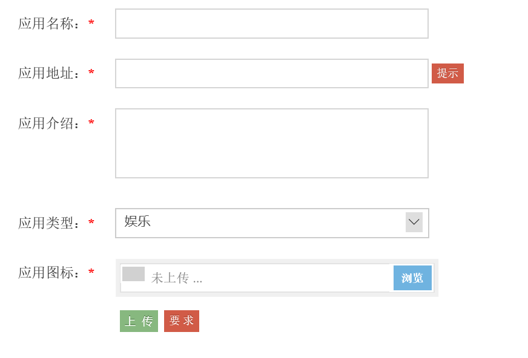
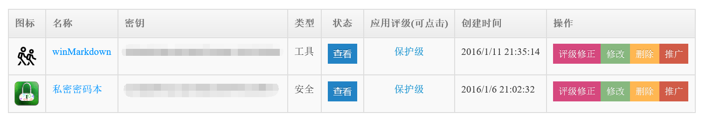
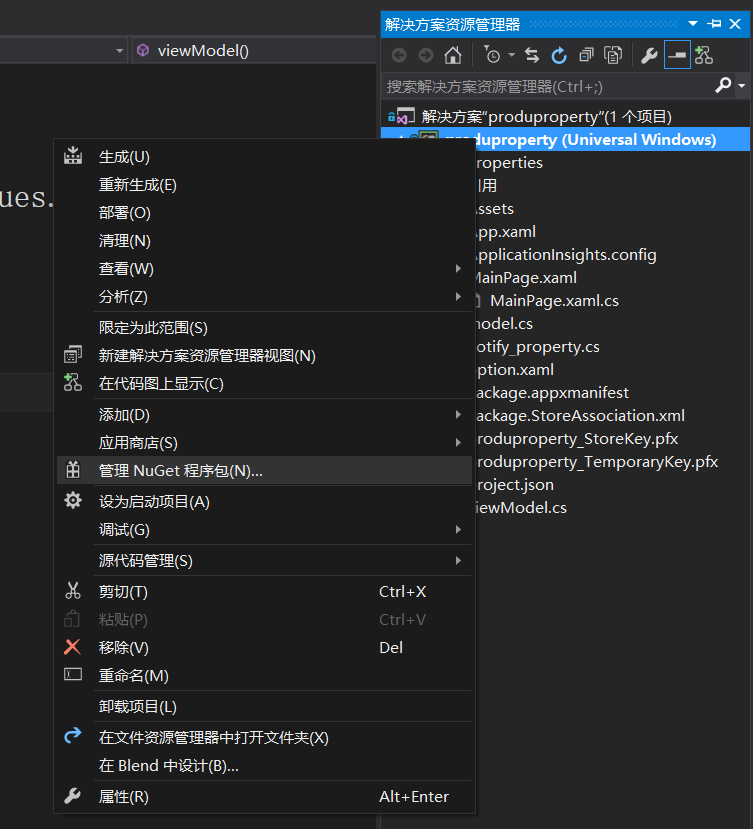
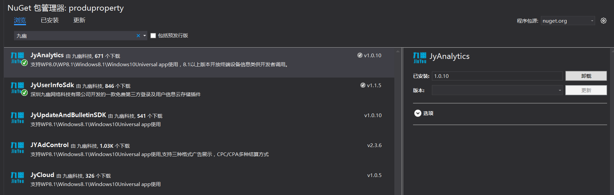
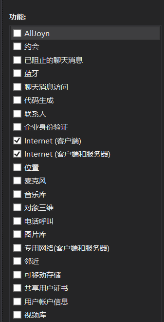

win10 UWP 九幽数据分析
九幽数据统计是统计和分析数据来源，用户使用，先申请账号

http://www.windows.sc



创建应用



图片要72*72
记密钥



在项目Nuget





在App.xaml.cs


```

        public App()
        {
            Microsoft.ApplicationInsights.WindowsAppInitializer.InitializeAsync(
                Microsoft.ApplicationInsights.WindowsCollectors.Metadata |
                Microsoft.ApplicationInsights.WindowsCollectors.Session);
            this.InitializeComponent();
            this.Suspending += OnSuspending;
            this.Resuming += App_Resuming;
        }

        private void App_Resuming(object sender, object e)
        {
            track();
        }

        protected override void OnActivated(IActivatedEventArgs args)
        {
            base.OnActivated(args);
            track();
        }

        private async void track()
        {
            await JYAnalyticsUniversal.JYAnalytics.StartTrackAsync("你的key");
        }

```

在OnLaunched加

```

track();

```

在OnSuspending加


```

        private async void OnSuspending(object sender, SuspendingEventArgs e)
        {
            var deferral = e.SuspendingOperation.GetDeferral();
            //TODO: 保存应用程序状态并停止任何后台活动
            await JYAnalyticsUniversal.JYAnalytics.EndTrackAsync(); //需注意此处代码位置不可更改 
            deferral.Complete();
        }

```

运行，等待九幽

页面统计


```

        protected override void OnNavigatedFrom(Windows.UI.Xaml.Navigation.NavigationEventArgs e)
        {
            base.OnNavigatedFrom(e);
            JYAnalytics.TrackPageEnd("main_page");
        }
        protected override void OnNavigatedTo(Windows.UI.Xaml.Navigation.NavigationEventArgs e)
        {
            base.OnNavigatedTo(e);
            JYAnalytics.TrackPageStart("main_page");
        }

```

统计次数


```

JYAnalytics.TrackEvent("StartTimes");

```


统计StartTimes次数


```

string eventId=“open";//当前统计的事件
string lable="打开blog.csdn.net/lindexi_gd";//描述当前id
JYAnalytics.TrackEvent(eventId,lable);

```

统计错误


```
string error=”“；
JYAnalytics.TrackError(error);

```

在Package.appxmanifest功能
Internet(客户端服务器)使用



