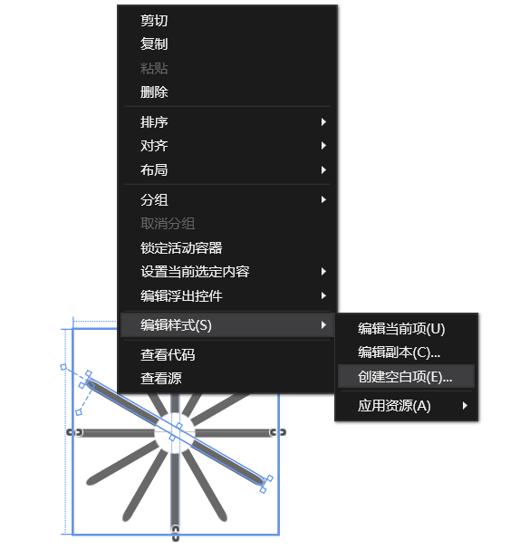
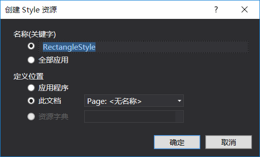
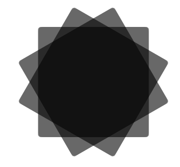
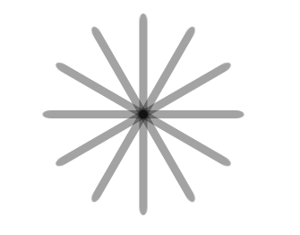

win10 UWP 圆形等待

看到一个圆形好像微软ProgressRing


我们可以用自定义控件

按ctrl+shift+a

用户控件

我们可以用Rectangle做圆形边

只要Rectangle RadiusX>0圆角

因为每个Rectangle 都一样，我们可以资源

```xaml

        <Grid.Resources>

            

        </Grid.Resources>

```

设置Rectangle 在中间

资源设置需要选TargetType

我们是Rectangle

```xaml

                <Style x:Key="RectangleStyle1" TargetType="Rectangle">

                </Style>

```

因为不知道这个要叫什么，就用右击资源





vs默认RectangleStyle1

每个项需要

```xaml

                    <Setter Property="" Value=""/>

```

设置中间

```xaml

                <Style x:Key="RectangleStyle1" TargetType="Rectangle">

                    <Setter Property="HorizontalAlignment" Value="Center"/>

                    <Setter Property="VerticalAlignment" Value="Center"/>

                </Style>

```

看起来Rectangle很大



把Height为20

```xaml

                    <Setter Property="Height" Value="50"/>

                    <Setter Property="Width" Value="2"/>

```



全部资源

```xaml

 <Style x:Key="RectangleStyle1" TargetType="Rectangle">

                    <Setter Property="RadiusX" Value="1"/>

                    <Setter Property="RadiusY" Value="2"/>

                    <Setter Property="Fill" Value="Black"/>

                    <Setter Property="Opacity" Value="0.2"/>

                    <Setter Property="RenderTransformOrigin" Value="0.5,0.5"/>

                    <Setter Property="HorizontalAlignment" Value="Center"/>

                    <Setter Property="VerticalAlignment" Value="Top"/>

                    <Setter Property="Height" Value="50"/>

                    <Setter Property="Width" Value="2"/>

                </Style>

```

我们做10个Rectangle 

使用RectangleStyle1 在Rectangle `style="{StaticResource RectangleStyle1}"`

中间是白色比较好

```xaml

            <Ellipse Height="10" Width="10" Fill="White" HorizontalAlignment="Center" VerticalAlignment="Center"/>

```


每个Rectangle 一个名字

我们想要xaml动，可以

```xaml

            <Grid.Triggers>

                <EventTrigger RoutedEvent="Grid.Loaded">

                    <BeginStoryboard>

                        <Storyboard RepeatBehavior="Forever">

                            <DoubleAnimation Storyboard.TargetName="r01" Storyboard.TargetProperty="Opacity" AutoReverse="True" Duration="0:0:0.08333" BeginTime="0:0:0.00000" To="0"/>

                            <DoubleAnimation Storyboard.TargetName="r02" Storyboard.TargetProperty="Opacity" AutoReverse="True" Duration="0:0:0.08333" BeginTime="0:0:0.08333" To="0"/>

                            <DoubleAnimation Storyboard.TargetName="r03" Storyboard.TargetProperty="Opacity" AutoReverse="True" Duration="0:0:0.08333" BeginTime="0:0:0.16666" To="0"/>

                            <DoubleAnimation Storyboard.TargetName="r04" Storyboard.TargetProperty="Opacity" AutoReverse="True" Duration="0:0:0.08333" BeginTime="0:0:0.24999" To="0"/>

                            <DoubleAnimation Storyboard.TargetName="r05" Storyboard.TargetProperty="Opacity" AutoReverse="True" Duration="0:0:0.08333" BeginTime="0:0:0.33332" To="0"/>

                            <DoubleAnimation Storyboard.TargetName="r06" Storyboard.TargetProperty="Opacity" AutoReverse="True" Duration="0:0:0.08333" BeginTime="0:0:0.41665" To="0"/>

                            <DoubleAnimation Storyboard.TargetName="r07" Storyboard.TargetProperty="Opacity" AutoReverse="True" Duration="0:0:0.08333" BeginTime="0:0:0.49998" To="0"/>

                            <DoubleAnimation Storyboard.TargetName="r08" Storyboard.TargetProperty="Opacity" AutoReverse="True" Duration="0:0:0.08333" BeginTime="0:0:0.58331" To="0"/>

                            <DoubleAnimation Storyboard.TargetName="r09" Storyboard.TargetProperty="Opacity" AutoReverse="True" Duration="0:0:0.08333" BeginTime="0:0:0.66664" To="0"/>

                            <DoubleAnimation Storyboard.TargetName="r10" Storyboard.TargetProperty="Opacity" AutoReverse="True" Duration="0:0:0.08333" BeginTime="0:0:0.74997" To="0"/>

                            <DoubleAnimation Storyboard.TargetName="r11" Storyboard.TargetProperty="Opacity" AutoReverse="True" Duration="0:0:0.08333" BeginTime="0:0:0.83330" To="0"/>

                            <DoubleAnimation Storyboard.TargetName="r12" Storyboard.TargetProperty="Opacity" AutoReverse="True" Duration="0:0:0.08333" BeginTime="0:0:0.91663" To="0"/>

                        </Storyboard>

                    </BeginStoryboard>

                </EventTrigger>

            </Grid.Triggers>

```

Forever一直动

使用控件

```xaml

        <local:round ></local:round>

```


全部

```xaml

round.xaml

<UserControl

    x:Class="roundload.round"

    xmlns="http://schemas.microsoft.com/winfx/2006/xaml/presentation"

    xmlns:x="http://schemas.microsoft.com/winfx/2006/xaml"

    xmlns:local="using:roundload"

    xmlns:d="http://schemas.microsoft.com/expression/blend/2008"

    xmlns:mc="http://schemas.openxmlformats.org/markup-compatibility/2006"

    mc:Ignorable="d"

    d:DesignHeight="300"

    d:DesignWidth="400">

    <Grid>

        <Grid>

            <Grid.Resources>

                <Style x:Key="RectangleStyle1" TargetType="Rectangle">

                    <Setter Property="RadiusX" Value="1"/>

                    <Setter Property="RadiusY" Value="2"/>

                    <Setter Property="Fill" Value="Black"/>

                    <Setter Property="Opacity" Value="0.2"/>

                    <Setter Property="RenderTransformOrigin" Value="0.5,0.5"/>

                    <Setter Property="HorizontalAlignment" Value="Center"/>

                    <Setter Property="VerticalAlignment" Value="Center"/>

                    <Setter Property="Height" Value="50"/>

                    <Setter Property="Width" Value="2"/>

                </Style>

            </Grid.Resources>

            <Rectangle x:Name="r01" Style="{StaticResource RectangleStyle1}">

                <Rectangle.RenderTransform>

                    <RotateTransform Angle="0"/>

                </Rectangle.RenderTransform>

            </Rectangle>

            <Rectangle x:Name="r02" Style="{StaticResource RectangleStyle1}">

                <Rectangle.RenderTransform>

                    <RotateTransform Angle="30"/>

                </Rectangle.RenderTransform>

            </Rectangle>

            <Rectangle x:Name="r03" Style="{StaticResource RectangleStyle1}">

                <Rectangle.RenderTransform>

                    <RotateTransform Angle="60"/>

                </Rectangle.RenderTransform>

            </Rectangle>

            <Rectangle x:Name="r04"  Style="{StaticResource RectangleStyle1}">

                <Rectangle.RenderTransform>

                    <RotateTransform Angle="90"/>

                </Rectangle.RenderTransform>

            </Rectangle>

            <Rectangle x:Name="r05"  Style="{StaticResource RectangleStyle1}">

                <Rectangle.RenderTransform>

                    <RotateTransform Angle="120"/>

                </Rectangle.RenderTransform>

            </Rectangle>

            <Rectangle x:Name="r06"  Style="{StaticResource RectangleStyle1}">

                <Rectangle.RenderTransform>

                    <RotateTransform Angle="150"/>

                </Rectangle.RenderTransform>

            </Rectangle>

            <Rectangle x:Name="r07"  Style="{StaticResource RectangleStyle1}">

                <Rectangle.RenderTransform>

                    <RotateTransform Angle="180"/>

                </Rectangle.RenderTransform>

            </Rectangle>

            <Rectangle x:Name="r08"  Style="{StaticResource RectangleStyle1}">

                <Rectangle.RenderTransform>

                    <RotateTransform Angle="210"/>

                </Rectangle.RenderTransform>

            </Rectangle>

            <Rectangle x:Name="r09"  Style="{StaticResource RectangleStyle1}">

                <Rectangle.RenderTransform>

                    <RotateTransform Angle="240"/>

                </Rectangle.RenderTransform>

            </Rectangle>

            <Rectangle x:Name="r10"  Style="{StaticResource RectangleStyle1}">

                <Rectangle.RenderTransform>

                    <RotateTransform Angle="270"/>

                </Rectangle.RenderTransform>

            </Rectangle>

            <Rectangle x:Name="r11"  Style="{StaticResource RectangleStyle1}">

                <Rectangle.RenderTransform>

                    <RotateTransform Angle="300"/>

                </Rectangle.RenderTransform>

            </Rectangle>

            <Rectangle x:Name="r12"  Style="{StaticResource RectangleStyle1}">

                <Rectangle.RenderTransform>

                    <RotateTransform Angle="330"/>

                </Rectangle.RenderTransform>

            </Rectangle>

            <Ellipse Height="10" Width="10" Fill="White" HorizontalAlignment="Center" VerticalAlignment="Center"/>

            <Grid.Triggers>

                <EventTrigger RoutedEvent="Grid.Loaded">

                    <BeginStoryboard>

                        <Storyboard RepeatBehavior="Forever">

                            <DoubleAnimation Storyboard.TargetName="r01" Storyboard.TargetProperty="Opacity" AutoReverse="True" Duration="0:0:0.08333" BeginTime="0:0:0.00000" To="0"/>

                            <DoubleAnimation Storyboard.TargetName="r02" Storyboard.TargetProperty="Opacity" AutoReverse="True" Duration="0:0:0.08333" BeginTime="0:0:0.08333" To="0"/>

                            <DoubleAnimation Storyboard.TargetName="r03" Storyboard.TargetProperty="Opacity" AutoReverse="True" Duration="0:0:0.08333" BeginTime="0:0:0.16666" To="0"/>

                            <DoubleAnimation Storyboard.TargetName="r04" Storyboard.TargetProperty="Opacity" AutoReverse="True" Duration="0:0:0.08333" BeginTime="0:0:0.24999" To="0"/>

                            <DoubleAnimation Storyboard.TargetName="r05" Storyboard.TargetProperty="Opacity" AutoReverse="True" Duration="0:0:0.08333" BeginTime="0:0:0.33332" To="0"/>

                            <DoubleAnimation Storyboard.TargetName="r06" Storyboard.TargetProperty="Opacity" AutoReverse="True" Duration="0:0:0.08333" BeginTime="0:0:0.41665" To="0"/>

                            <DoubleAnimation Storyboard.TargetName="r07" Storyboard.TargetProperty="Opacity" AutoReverse="True" Duration="0:0:0.08333" BeginTime="0:0:0.49998" To="0"/>

                            <DoubleAnimation Storyboard.TargetName="r08" Storyboard.TargetProperty="Opacity" AutoReverse="True" Duration="0:0:0.08333" BeginTime="0:0:0.58331" To="0"/>

                            <DoubleAnimation Storyboard.TargetName="r09" Storyboard.TargetProperty="Opacity" AutoReverse="True" Duration="0:0:0.08333" BeginTime="0:0:0.66664" To="0"/>

                            <DoubleAnimation Storyboard.TargetName="r10" Storyboard.TargetProperty="Opacity" AutoReverse="True" Duration="0:0:0.08333" BeginTime="0:0:0.74997" To="0"/>

                            <DoubleAnimation Storyboard.TargetName="r11" Storyboard.TargetProperty="Opacity" AutoReverse="True" Duration="0:0:0.08333" BeginTime="0:0:0.83330" To="0"/>

                            <DoubleAnimation Storyboard.TargetName="r12" Storyboard.TargetProperty="Opacity" AutoReverse="True" Duration="0:0:0.08333" BeginTime="0:0:0.91663" To="0"/>

                        </Storyboard>

                    </BeginStoryboard>

                </EventTrigger>

            </Grid.Triggers>

        </Grid>

    </Grid>

</UserControl>

```

```xaml

MainPage

<Page

    x:Class="roundload.MainPage"

    xmlns="http://schemas.microsoft.com/winfx/2006/xaml/presentation"

    xmlns:x="http://schemas.microsoft.com/winfx/2006/xaml"

    xmlns:local="using:roundload"

    xmlns:d="http://schemas.microsoft.com/expression/blend/2008"

    xmlns:mc="http://schemas.openxmlformats.org/markup-compatibility/2006"

    mc:Ignorable="d">

    <Grid Background="{ThemeResource ApplicationPageBackgroundThemeBrush}">

        

        <local:round ></local:round>

    </Grid>

</Page>

```

代码：https://github.com/lindexi/lindexi_gd/tree/master/roundload

参考：http://blog.csdn.net/qqamoon/article/details/7001693

