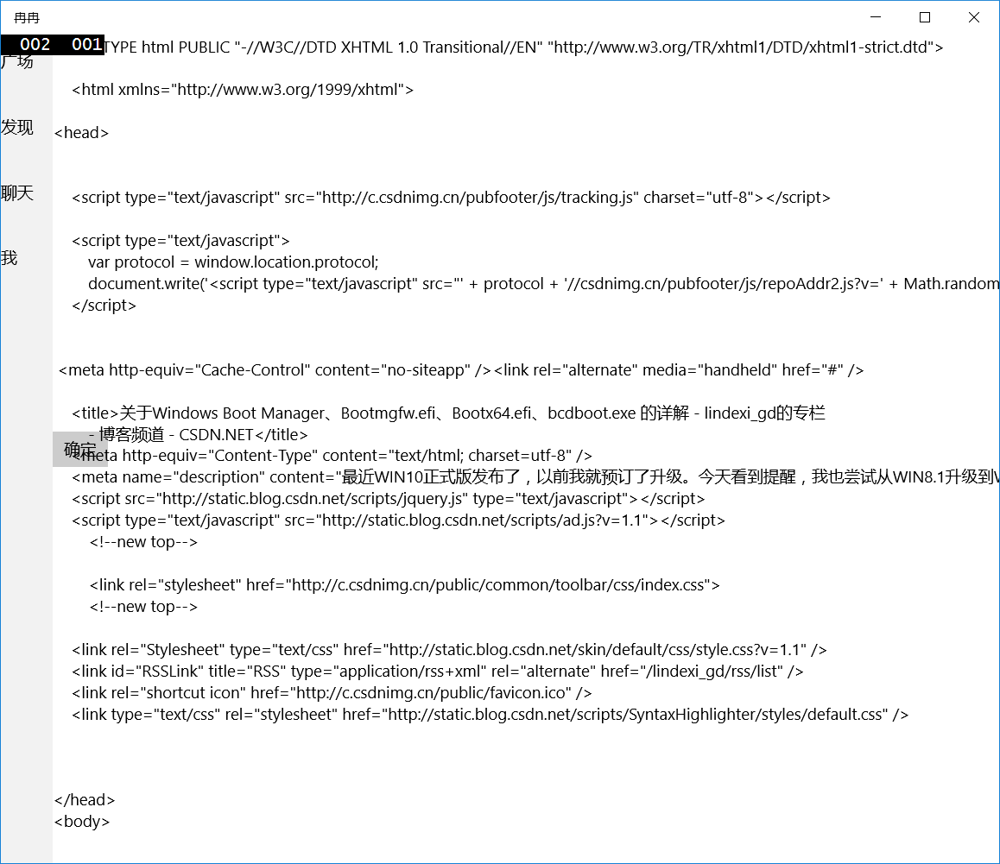
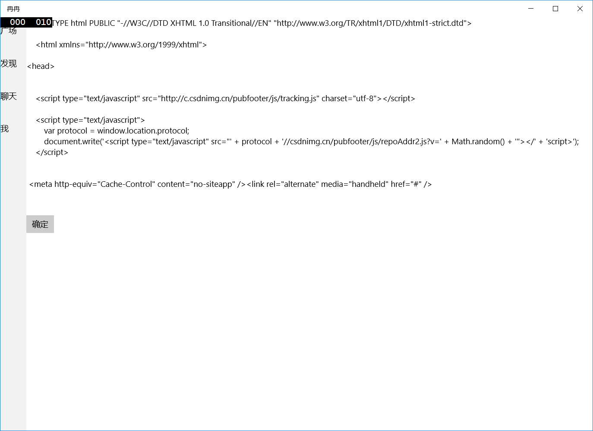

win10 UWP 访问网页

Windows10 UWP要访问博客，可以使用Windows.Web.Http.HttpClient

```C#

            string str = "http://blog.csdn.net/lindexi_gd/article/details/50392343";

            using (Windows.Web.Http.HttpClient client = new Windows.Web.Http.HttpClient())

            {

                try

                {

                    Windows.Web.Http.HttpResponseMessage response = await client.GetAsync(new Uri(str));

                    if (response != null && response.StatusCode == Windows.Web.Http.HttpStatusCode.Ok)

                    {

                        using (Windows.Storage.Streams.InMemoryRandomAccessStream stream = new Windows.Storage.Streams.InMemoryRandomAccessStream())

                        {

                            await response.Content.WriteToStreamAsync(stream);

                            stream.Seek(0);                            

                            Windows.Storage.Streams.Buffer buffer = new Windows.Storage.Streams.Buffer((uint)stream.Size);

                            await stream.ReadAsync(buffer, (uint)stream.Size, Windows.Storage.Streams.InputStreamOptions.Partial);

                            using (Windows.Storage.Streams.DataReader dataReader = Windows.Storage.Streams.DataReader.FromBuffer(buffer))

                            {

                                tb.Text = dataReader.ReadString((uint)stream.Size);

                            }

                        }

                    }

                }

                catch

                {

                }

```

在前台有一个TextBlock，名字tb

按钮

按钮点击触发上面，访问博客，把内容放在tb



HttpWebRequest

```C#

            System.Net.HttpWebRequest request = null;

            request = System.Net.WebRequest.Create(str) as System.Net.HttpWebRequest;

            request.Accept = "text/html, application/xhtml+xml, image/jxr, */*";

            request.Method = "GET";

            request.CookieContainer = new System.Net.CookieContainer();

            try

            {

                System.Net.HttpWebResponse response = (System.Net.HttpWebResponse)await request.GetResponseAsync();

                if (response != null && response.StatusCode==System.Net.HttpStatusCode.OK)

                {

                    tb.Text = response.ContentLength.ToString();

                    using (Stream stream= response.GetResponseStream())

                    {

                        byte[] buffer = new byte[10240];

                        stream.Read(buffer, 0, 10240);

                        tb.Text = System.Text.Encoding.UTF8.GetString(buffer);

                    }

                }

            }

            catch

            {

            }

```



http://blog.csdn.net/lindexi_gd